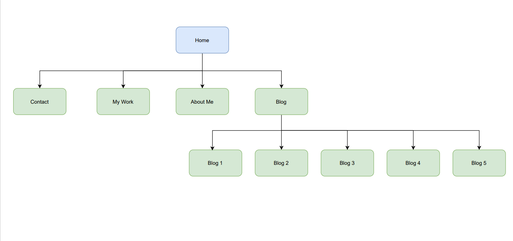

# Simon Tanna's Portfolio 1
### SIMONTANNA_T1A2

## Portfolio Website
<https://simontanna.netlify.app/>

## Github Repository
<https://github.com/simon-tanna/SImonTanna_T1A2>  

## Website Overview 

### Purpose
The purpose of this website project is to showcase my portfolio of work as a web dev and IT professional. The primary work featured is the website itself and is designed to have future projects added over time as my career progresses.  
Additional information such as a short biography, resumè, blog and contact details are also included.   

### Target Audience
The website is aimed at potential employers looking to engage a dev/IT professional. It is assumed in the content of the website that the employer has technical knowledge of IT, software development and coding.   

## Site Map

## Tech Stack 
#### **Front End**
- HTML5
- CSS 3

#### **Back End**
- Netlify
- Github
- Git

#### **UX/UI**
- Balsamiq
- diagrams.net

#### **Art Design**
- Prisma
- Canva
- coolors.co

#### **Project Management**
- Trello
    - <https://trello.com/c/iAst6bx5>

## Website Features and Functionality
### Design
This website was built from a "mobile first" perspective with media break-points existing at up to 480px and 768px and over 769px to cater for mobile, tablet and desktop browsers. Below is the wireframe mock-up of the home page featuring the 3 different views.    

    

I was able to easily translate this design to my html and css code as illustrated below.    

The design of the header being centered in mobile and tablet views is consistent through all child pages.   
In the About, Contact and My Work pages, I have kept a consistent format of an image aligned to the left in a flex display for the desktop view and aligned to the top of the page in mobile and tablet view as illustrated below.  

    
  

The blog and blog child pages depart from this structure. The blog parent page displays flexbox images with links in rows of two both in desktop and tablet view. Mobile view the reverts to a single image and link per row as is evidenced in the below wireframes and screenshots.

 
    

### Art and Colour

The colour palette used for the website head, footer, background and personal logo has been designed to reflex a calm yet professional feel to the site. Below is the palette used.   

### Accessibility

To provide optimal accessibility to the website, all images, external links and embedded playlists feature alternative text. To ensure font compatability, all fonts have fall-back web safe alternatives.  
Where possible semantic HTML elements have been used in order to create meaning to the html code. An example of this is the use of the "article" element in the blog posts.

### CSS Animation and Effects

In order to maintain a professional looking website that is user friendly, the CSS animations used are simple yet effective in enhancing the user experience. Changes in hover opacity in navbar links and hover border shadow in blog links are examples of this. Adjustments to the hover transition duration have also been made. The 'Creative' skill listed in index.html is animated to change colour through CSS code. Consideration was given to adding further CSS effects but it was determined that they may clutter the overall relaxed feel of the site.

### Site Navigation

Navbars are consistent in the header and footer of all site pages to ensure easy navigation. Each blog post features a 'Back to Blog Main' link at the conclusion of the post to enhance easy access to blog content.

## Sub-resource Security
The sub-recsource security hash used in the stylesheet is SHA-512.

## Stock Image and Artwork Credits

### **blog.html**
Blog-1-image.jpg
- Image by Pawel Czerwinski via https://unsplash.com/photos/eybM9n4yrpE

blog-2-image.jpg
- Image by Sandy Millar via https://unsplash.com/photos/yvpexJFLTSU

blog-3-image.jpg
- Image by Nathan Dumlao via https://unsplash.com/photos/l59fmhtprIE

blog-4-image.jpg
- Image by Nick Karvounis via https://unsplash.com/photos/TkZYCXmrKK4

blog-5-image.jpg
- Image by Matt Duncan via https://unsplash.com/photos/IUY_3DvM__w

### **resume.html**
resume-pic.jpg
- Image by Safar Safarov via https://unsplash.com/photos/koOdUvfGr4c

### **contact.html**
contact-me.jpg
- Image by Michal Biernat via https://unsplash.com/photos/h0xEUQXzU38

### **Social Media Icons**
icons8-github-96.png    
icons8-instagram-96.png   
icons8-linkedin-96.png
- Icons by icons8 via https://icons8.com/

*
